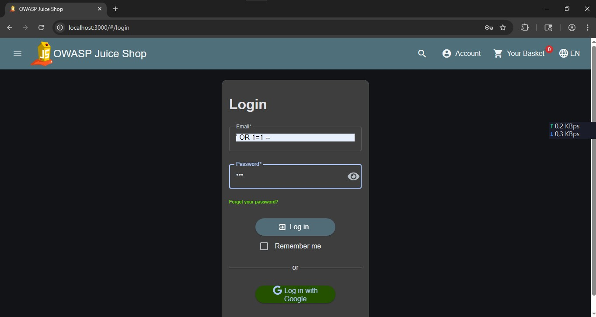
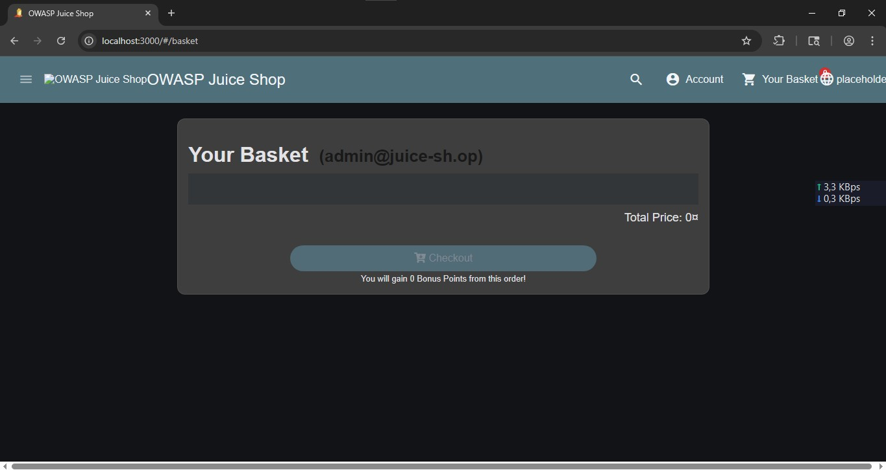

# Authentication Bypass via SQL Injection

## Overview

An SQL Injection vulnerability was identified in the authentication mechanism of OWASP Juice Shop. The application accepted unsanitized user input, allowing authentication to be bypassed using a crafted SQL payload. This assessment was performed exclusively in a controlled homelab environment for educational purposes.

**Severity:** High

---

## Affected Component

- Login Page

---

## Tools

- Chromium
- OWASP Juice Shop

---

## Reproduction

1. Open the OWASP Juice Shop login page.
2. Enter the following payload into the email field:

```text
' OR 1=1 --
```

3. Submit the login request.
4. Observe that authentication is bypassed and access is granted.

---

## Evidence

- Login page before testing.
- Authentication request.
- Successful login after submitting the payload.




---

## Impact

In a real-world application, this vulnerability could allow unauthorized users to gain access to privileged accounts, potentially leading to unauthorized access to sensitive data and administrative functionality.

---

## Recommendation

- Use parameterized queries or prepared statements.
- Validate and sanitize user input.
- Avoid dynamically constructing SQL queries.
- Implement secure authentication mechanisms.

---

## References

- OWASP Top 10 – Injection
- OWASP Web Security Testing Guide