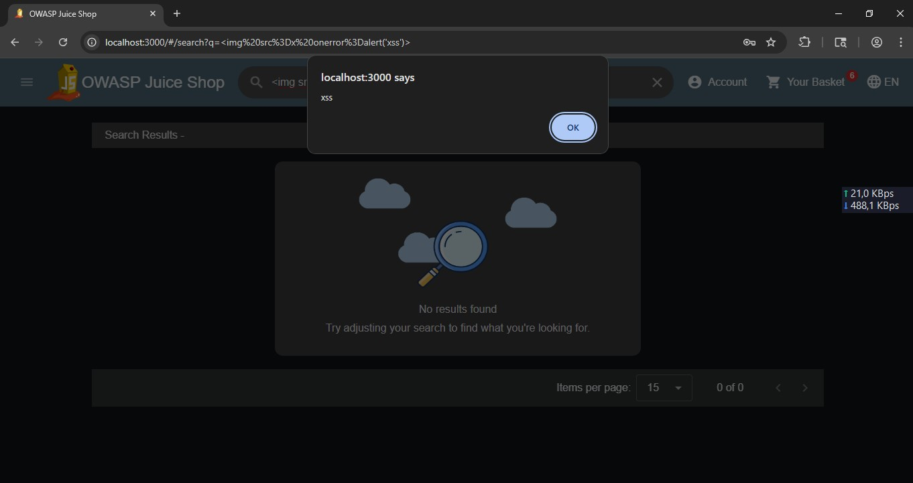

# Reflected Cross-Site Scripting (XSS)

## Overview

A reflected Cross-Site Scripting (XSS) vulnerability was identified in the search functionality. User-controlled input was reflected back to the browser without proper output encoding, allowing JavaScript execution.

**Severity:** Medium

---

## Affected Component

- Search Functionality

---

## Tools

- Web Browser (Mozilla Firefox)
- OWASP Juice Shop

---

## Reproduction

1. Open the OWASP Juice Shop homepage.
2. Enter the following payload into the search bar:

```html

```

3. Submit the search request.
4. Observe that the browser executes the injected JavaScript.

---

## Evidence

- Search page before testing.
- Payload entered into the search bar.
- JavaScript alert displayed in the browser.



---

## Impact

In a real-world application, reflected XSS could allow attackers to execute malicious JavaScript in a victim's browser, potentially leading to session hijacking, phishing attacks, or unauthorized actions performed on behalf of the user.

---

## Recommendation

- Apply proper output encoding.
- Validate and sanitize user input.
- Implement Content Security Policy (CSP).
- Avoid reflecting unsanitized user input.

---

## References

- OWASP Top 10 – Cross-Site Scripting
- OWASP Web Security Testing Guide